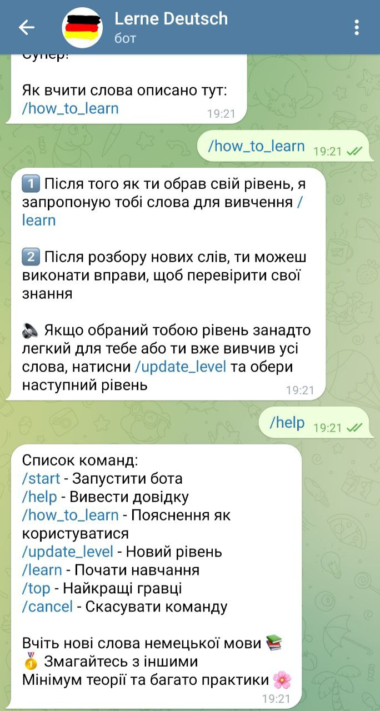
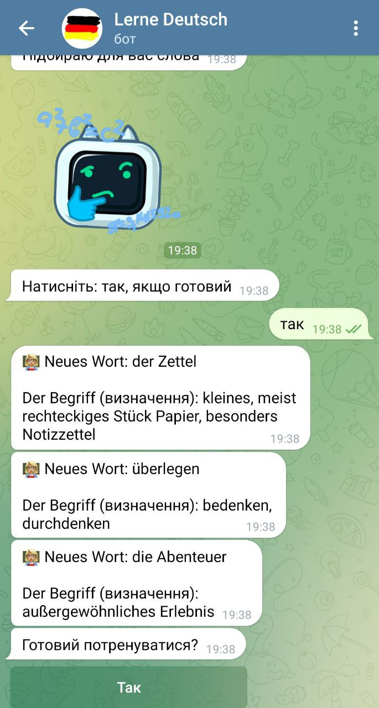

# Lerne Deutsch Bot

### The main idea of this bot is to help people learn German words

Purpose of this bot:
* Learn new German words 
* Compete with others
* A minimum of theory and a lot of practice
___
### Commands

1. There is ___/help___  and ___/how_to_learn___ command to explain how to use this bot

   

2. You can ___update___ your level if all the words are learned   

3. The main function is ___/learn___ which you can use to learn new words

   

4. ___Top of the best players___ is available to make your education more interesting

___